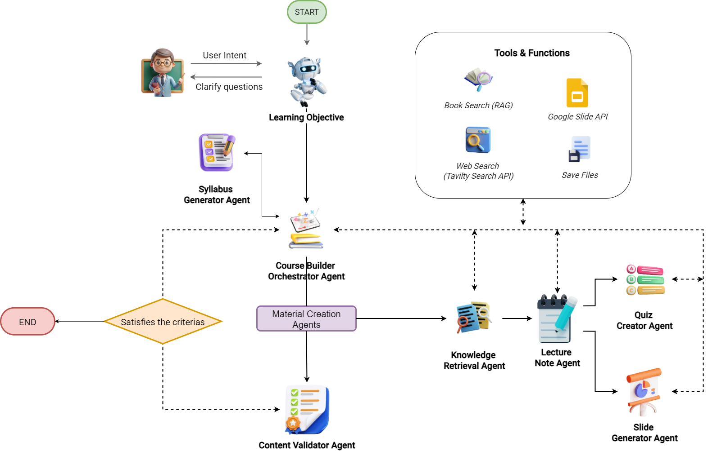

# 🌟 EUREKA: Multi-Agent AI System for Educational Content Generation

 

> **"Empowering educators by automating the creation of high-quality, scalable learning materials."**

EUREKA is an AI-powered multi-agent system designed to generate cohesive educational packages including **lecture notes**, **presentations**, and **quizzes**, tailored to specific learning objectives. The system is built using a distributed architecture with a modern web frontend (Next.js), real-time backend (FastAPI + WebSockets), and advanced AI orchestration using `LangGraph` and `PydanticAI`.

---

## 📽️ Demo Video

🎥 Watch our full walkthrough here: [▶️ YouTube Demo](https://youtu.be/0uGupxk7qaA)

---

## ✨ Key Features

- 🔄 **End-to-end automation** of curriculum-based content creation
- 🧠 **Multi-Agent System** with task-specialized AI agents (Lecture, Slides, Quiz, QA, etc.)
- 📚 Supports **document uploads (PDF)** and **web search (RAG)** for content grounding
- 🧩 **Real-time feedback loop** and content refinement via LangGraph
- 🌐 **Next.js frontend** + **FastAPI backend** with WebSocket integration
- ☁️ **Cloud-enabled**: AWS S3, MongoDB, PostgreSQL, ChromaDB for vector search

---

## 🧠 System Architecture



The system includes the following agents:

| Agent                     | Role                                                                 |
|--------------------------|----------------------------------------------------------------------|
| 🎯 Clarification Agent   | Dialogues with user to define objectives and constraints             |
| 🧭 Curriculum Agent      | Designs modular course structure                                      |
| 🔍 Retrieval Agent       | Uses RAG + Web search for fact grounding                             |
| 📝 Note Generator        | Produces structured lecture notes                                     |
| 📊 Slide Generator       | Builds Google Slides presentations using chosen templates            |
| ❓ Quiz Generator         | Creates MCQs with distractors, aligned to objectives                 |
| ✅ Quality Agent          | Evaluates content on clarity, pedagogy, correctness, and alignment   |
| 🧠 Orchestrator Agent    | Manages task flow and quality iteration using LangGraph              |

---

## 🚀 Getting Started

### 🔧 Prerequisites

- Node.js (v18+)
- Python 3.10+
- `pip`, `virtualenv` or `conda`
- MongoDB, PostgreSQL (local or cloud)
- AWS account (for S3)
- Google Slides API credentials

---

### 🖥️ Local Setup

#### 1. Clone the repo
```bash
git clone https://github.com/QuangTruong-Nguyen/Edu_MAS.git

cd Edu_MAS

```

### 🖥️ 2. Install Frontend (Next.js)

Make sure you have [Node.js](https://nodejs.org/) installed.

```bash

# Start the development server
npm run dev
```

### 🐍 3. Run Backend API & WebSocket (Python + FastAPI)

Make sure you have Python 3.10+ and `pip` installed.

```bash
# Install required Python packages
pip install -r requirements.txt

# Start the FastAPI backend server
python ./backend/api.py

# Start the WebSocket server in a separate terminal
python ./backend/websocket.py
```


---

## 🧪 4. System Workflow

The EUREKA system operates through a coordinated Multi-Agent System (MAS) to generate educational content automatically and iteratively. Below is a high-level overview of the workflow:

1. **User Login & Input**
   - The user logs in via the frontend (Clerk authentication).
   - Uploads a textbook or learning resource in PDF format.
   - Enters initial requirements: topic, target audience, and educational goals.

2. **PDF Processing & Information Retrieval**
   - The system extracts text from the PDF using the `Unstructured` library.
   - The content is chunked, embedded, and stored in **ChromaDB** for vector-based semantic search.
   - Additional web-based information is retrieved via **DuckDuckGo Search API** if needed (RAG).

3. **Requirement Clarification & Curriculum Design**
   - The **Clarification Agent** interacts with the user to refine goals.
   - The **Curriculum Agent** generates a detailed learning path and module breakdown based on the refined objectives.

4. **Content Generation Loop (per lesson/module)**
   - The **Retrieval Agent** gathers facts from uploaded documents and the web.
   - The **Lecture Note Agent** synthesizes structured educational text.
   - The **Slide Generator Agent** creates Google Slides presentations with the chosen template.
   - The **Quiz Generator Agent** formulates MCQs with correct answers and distractors.

5. **Quality Evaluation & Refinement**
   - The **Quality Assurance Agent** evaluates each piece of generated content for:
     - Accuracy, clarity, alignment with objectives, and completeness.
   - If the content doesn't meet quality thresholds, the **Orchestrator Agent** triggers a feedback loop for refinement.
6. **Final Output & User Review**

> 🧠 Workflow coordination is handled by the **Orchestrator Agent** using **LangGraph** to manage state transitions and control agent execution.

---

## 🧰 5. Tech Stack

EUREKA is built with a modern, modular architecture that leverages cutting-edge technologies across the frontend, backend, AI orchestration, and data layers.

### 🖥️ Frontend

- **Next.js** – React-based framework for server-side rendering and routing
- **Tailwind CSS** – Utility-first CSS framework for rapid UI design
- **shadcn/ui** – Beautiful, accessible UI components
- **WebSocket** – Real-time communication with backend agents

### 🧠 Backend

- **FastAPI** – High-performance Python web framework for APIs
- **LangGraph** – Graph-based orchestration of AI agent workflows
- **Pydantic AI** – Structured schema definition for agent inputs/outputs
- **Unstructured** – Extract text from PDFs and other unstructured files
- **Tavily Search API** – Web search for external information (RAG)

### 📦 Databases

- **MongoDB** – Flexible schema for chat/session history and agent logs
- **ChromaDB** – Vector store for semantic document search

### ☁️ Cloud Services

- **AWS S3** – Storage of uploaded PDFs and generated outputs
- **Google Slides API** – Automatic slide generation with templates
- **Clerk** – Authentication and session management

### 🤖 AI & LLMs

- **OpenAI GPT-4 / GPT-3.5** – Core large language model for generation and reasoning
- **Retrieval-Augmented Generation (RAG)** – Factual grounding via vector search

> 💡 The system is modular and extensible — you can easily swap out components like the vector store or LLM provider.
